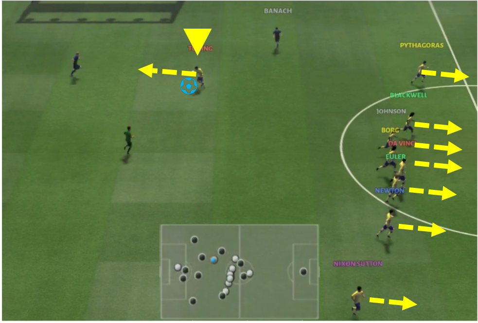
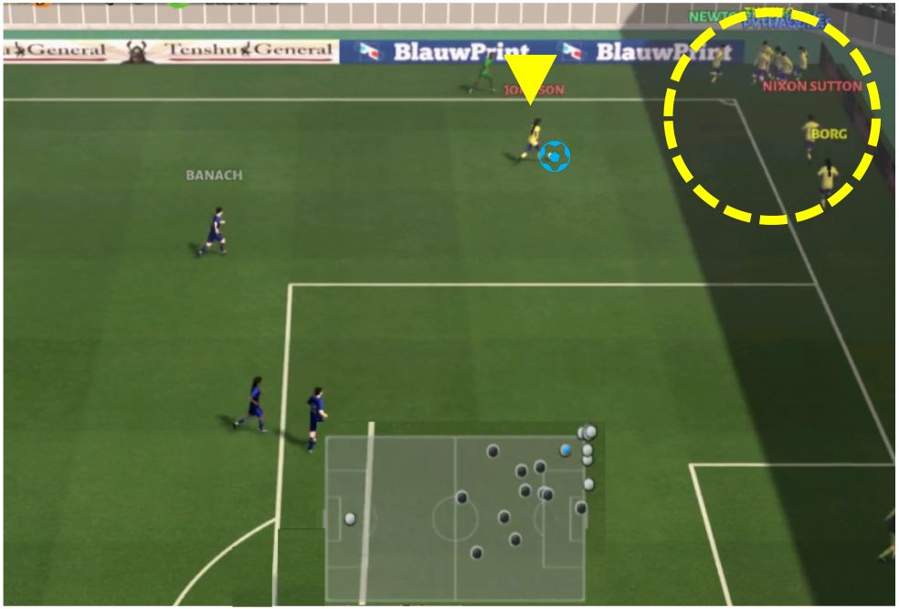
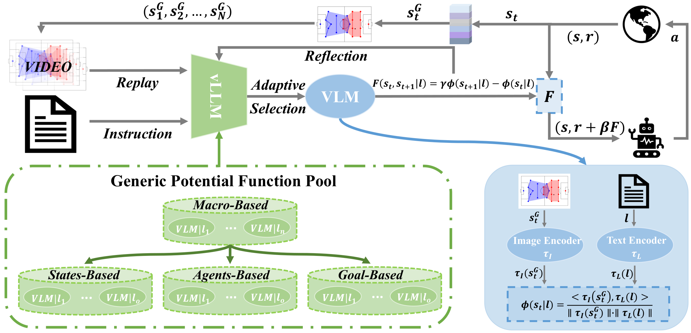
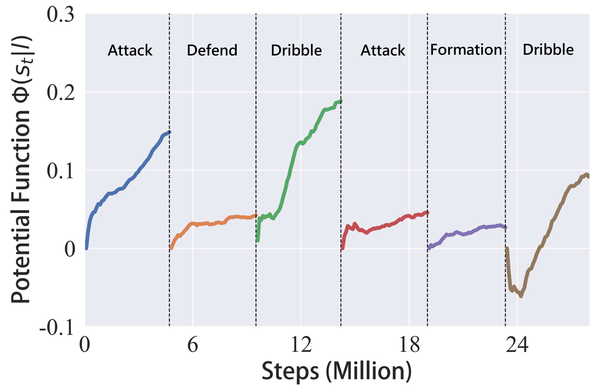
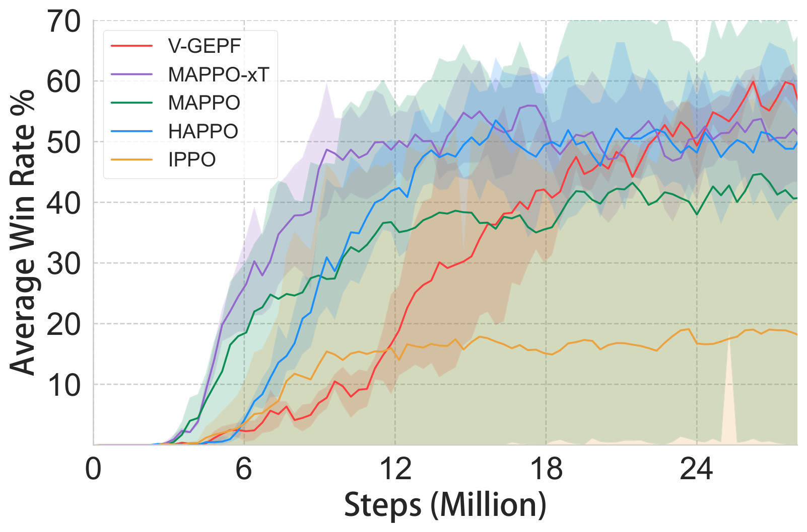
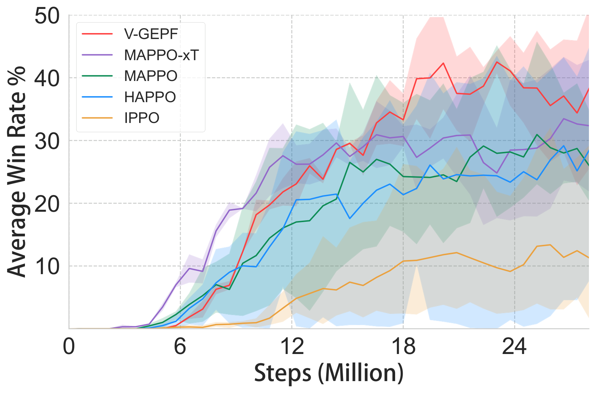
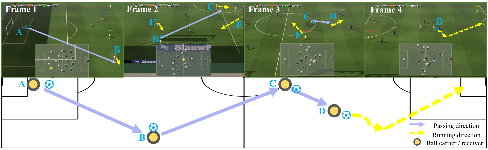

# 基于视觉的通用势函数（V-GEPF）

[English](README.md) | [中文](README_CN.md)

[](https://aaai.org/conference/aaai/aaai-25/)
[](https://arxiv.org/abs/2502.13430)
[](https://www.python.org/downloads/)
[](https://pytorch.org/)

---

## 🏛️ 关于本仓库

本仓库由 **[CASIA-Collect-AI](https://github.com/CASIA-Collect-AI)** 收录维护，作为高质量 MARL 研究代码的精选集合。

📌 **原始仓库（推荐访问）：** [Marroh/V-GEPF-official-code](https://github.com/Marroh/V-GEPF-official-code)
⭐ **如果本工作对你有帮助，请前往原始仓库点 Star 支持作者！**

> **团队：** 中国科学院自动化研究所 飞行器智能技术团队（群体智能团队-蒲志强）
> CASIA-Collect-AI 收录和维护 MARL、LLM 和机器人领域的高质量开源研究代码。

---

**《基于视觉的通用势函数在多智能体强化学习策略对齐中的应用》** 官方实现（AAAI 2025）

**作者：** 马昊，王士杰，蒲志强，赵思遥，艾晓林
**单位：** 中国科学院自动化研究所；中国科学院大学

---

## 摘要

在谷歌研究足球（GRF）等复杂环境中，多智能体强化学习（MARL）面临一个核心挑战：智能体往往收敛到局部最优但战术质量低劣的策略——缺乏协调、站位不合理，与人类直觉相去甚远。

本文提出 **V-GEPF**，利用视觉语言模型（VLM）为 MARL 策略对齐生成**基于势函数的奖励塑造**。核心思想：将游戏状态编码为图像，并与人类语言指令计算余弦相似度，从而提供一种通用的、人类可解释的奖励信号，无需针对特定环境设计奖励函数，即可引导智能体学习期望的战术风格。

**三大核心贡献：**
1. 基于图文余弦距离的 VLM **通用势函数**设计
2. 自适应 **vLLM 选择器**，根据历史回合视频回放自动选择合适的势函数
3. 在 GRF 11-vs-11 任务上实现策略对齐，性能超越 PPO/MAPPO/HAPPO 基线

---

## 📖 论文深度解读

### 核心问题：复杂 MARL 中的策略失调

在 GRF 11-vs-11 场景中，标准 MARL 训练（MAPPO、HAPPO）产生的策略虽然能够赢球，但战术质量低劣：

<div align="center">
  
  
</div>

*（左）MAPPO：非持球球员无法占据有价值的空间。（右）HAPPO：球员缺乏有效的站位与跑位来为持球球员创造传球机会。*

仅凭奖励信号无法编码战术质量——混乱进球与配合默契的团队进球在数值上是等价的。V-GEPF 通过视觉驱动的奖励塑造解决这一问题。

---

### V-GEPF 框架

<div align="center"></div>

*V-GEPF 框架：游戏状态图像 + 人类指令 → CLIP 余弦距离 → 势函数奖励 → 策略对齐。vLLM 观看回合录像，自适应选择应用哪种势函数。*

**两阶段设计：**

**第一阶段 — 基于 CLIP 的势函数**
- 将游戏状态渲染为图像 $s_t^G$
- 人类指令 $l$（如"保持三角传球站位"）编码为文本
- 图文嵌入的余弦距离定义势函数：$\phi(s_t | l) = \text{cos}(\text{enc}_\text{img}(s_t^G), \text{enc}_\text{txt}(l))$
- 基于势的奖励塑造：$r'_t = r_t + \gamma \phi(s_{t+1}) - \phi(s_t)$

**第二阶段 — vLLM 自适应选择器**
- 每个训练阶段开始时，vLLM（如 MiniCPM-o）观看上一回合的视频录像
- 结合势函数池和历史选择反思，vLLM 选择最合适的当前指令
- 实现课程式学习：早期阶段聚焦基础站位，后期阶段针对高阶战术

---

### 自适应势函数选择

<div align="center"></div>

*训练过程中的势函数曲线。vLLM 依次选择六种不同的 VLM 势函数，引导智能体逐步掌握更复杂的战术行为。*

vLLM 根据当前策略的视频回放证据，从人类定义的指令池（进攻、防守、阵型、盘带等）中选择训练重点——模拟人类教练根据比赛表现调整训练方向的方式。

---

### 实验结果

**测试环境：** 谷歌研究足球（GRF）
- **11-vs-11 简单模式**：标准对手 AI
- **11-vs-11 困难模式**：更强对手 AI
- **学院场景**：counterattack_easy、counterattack_hard（迁移实验）

<div align="center"></div>

*GRF 11-vs-11 简单模式胜率曲线。V-GEPF + MAPPO 持续优于 MAPPO、HAPPO 及基线变体。*

<div align="center"></div>

*GRF 11-vs-11 困难模式胜率曲线。V-GEPF 在更强对手下仍保持优势。*

**核心发现：**
- V-GEPF 在所有 GRF 场景中均提升胜率
- 策略可视化验证了战术质量改善（协调传球、结构化阵型）
- 基于 xT 的非 VLM 方案同样优于基线，验证了势函数塑造方法的有效性

---

### 视觉策略分析

<div align="center"></div>

*V-GEPF 策略在进攻阶段的可视化分析。智能体形成有组织的站位和连贯的传球配合，与人类足球直觉高度一致——这正是 VLM 引导势塑造的直接结果。*

---

## 安装

```bash
conda create -n v-gepf python=3.9
conda activate v-gepf
```

1. **安装谷歌研究足球** 参照 [官方仓库](https://github.com/google-research/football)

2. **安装基础框架：**
   ```bash
   pip install -e .
   ```

3. **安装 MiniCPM-o** 参照 [官方指南](https://github.com/OpenBMB/MiniCPM-o)

---

## 快速开始

### 配置

在 `light_malib/vlm/vlm_critic.py` 中设置模型路径：
```python
class LocalMiniCPM:
    def __init__(self, model_path='/path/to/MiniCPM-Llama3-V-2_5', device='auto'):
        ...

class CLIPCritic:
    def __init__(self):
        self.clip, self.preprocess = clip.load("/path/to/CLIP/RN50.pt", device="cuda")
```

（可选）在 `light_malib/vlm/utils.py` 中设置 OpenAI API Key（使用 GPT 系列 VLM 时）。

### 运行实验

```bash
# V-GEPF + MAPPO，11-vs-11 场景
sh scripts/run_vllm_mappo_11v11.sh

# 基于 xT 的势函数（非 VLM 替代方案）
# 取消注释 light_malib/envs/gr_football/env.py 中 step() 的 xT 计算代码块
```

---

## 核心实现

| 文件 | 说明 |
|------|------|
| `light_malib/vlm/vlm_critic.py` | VLM 评论员：`MiniCPMCritic`、`CLIPCritic`——从游戏状态图像计算势函数奖励 |
| `light_malib/vlm/utils.py` | `RealTimeDrawer`（状态→图像）、`vLLMAgent` + `vLLMMemory`（自适应选择器） |
| `light_malib/algorithm/mappo/trainer.py` | 集成势函数奖励的 MAPPO 训练循环，基于 Ray 实现可扩展并行化 |

---

## 引用

```bibtex
@inproceedings{ma2025vision,
  title={Vision-Based Generic Potential Function for Policy Alignment in Multi-Agent Reinforcement Learning},
  author={Ma, Hao and Wang, Shijie and Pu, Zhiqiang and Zhao, Siyao and Ai, Xiaolin},
  booktitle={Proceedings of the AAAI Conference on Artificial Intelligence},
  volume={39},
  number={18},
  pages={19287--19295},
  year={2025}
}
```

---

## 联系方式

- **第一作者：** 马昊 — 中国科学院自动化研究所
- **通讯作者：** zhiqiang.pu@ia.ac.cn（蒲志强教授）
